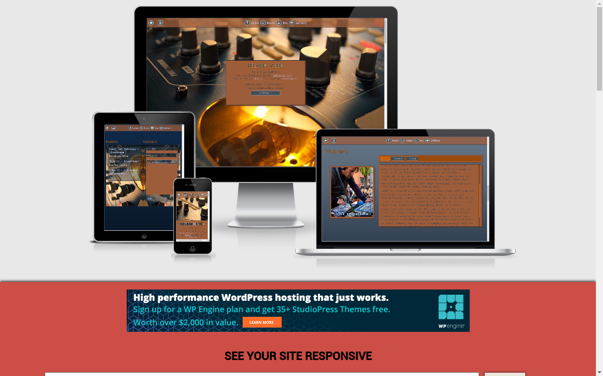

# Seldom Seen electronics



As i am also a music producer , called Seldom Seen , i was in the need of a proper website where users can find more
information about me , listen to my music and hopefully come visit my future perfomances.

## Visit the site in Github pages [here](https://josvelema.github.io/milestone1-UCFD/cd).

## 1. UX

The website is aime at three groups. The first and main group of user is people who listen
to (underground) electonic music. The other two groups are party promoters/label owners and other
producers who are looking for a collabaration. Ofcourse the user can also be someone who is a combination
of the user groups.


#### 1.2. User Stories

User story’s

#####         User#1


>As a fan of underground electronic music
>i want to find music of that genre
>so i can listen and download tracks.

- Features for User#1

>Abiliaty to listen to music & soundcloud intergration

>Find out about SSE’s music & download/listen

- Value for me

>  More listeners of my music
---
#####        User#2

>As an visitor of an SSE’s concert
>i want to look up more information about SSE
>so i can read more about his music and find out about upcoming events

- Features for User#2

>Biography section

>event section with events in the past (image gallery with captions)
>and upcoming events in a calender

- value for me 

>gain more fans and more visitors of my events
---
 #####        User#3

>As a label owner
>i want to contact SSE
>so i can invite him to release a track on my label.

- Features for User#3

>Feedback ability in music section

>contact form

- value for me

> getting my music released
---
#####       User#4

>As an electronic music artist
>i want to find fellow producers
>so i can exchange knowledge and collaborate

- Features for User#4

>Linking the website on soundcloud and facebook

>contact/feedback form

- value for me

> make music with other producers
---
#### 1.3. Wireframes

The wireframes were designed using [draw.io](https://draw.io/). They're accessible in the following links:

|                 Desktop                 |             Mobile             |
| :-------------------------------------: | :----------------------------: |
|  [main page](mockups/desktop/mainDesktop.pdf)  |  [main page](mockups/mobile/mainPhone.pdf)  |
| [intro page](mockups/desktop/introDesktop.pdf)  | [intro page](mockups/mobile/introPhone.pdf)  |
| [music page](mockups/desktop/musicDesktop.pdf) | [music page](mockups/mobile/musicPhone.pdf) |
| [bio page](mockups/desktop/bioDesktop.pdf) | [bio page](mockups/mobile/bioPhone.pdf) |
| [gallery](mockups/desktop/galleryDesktop.pdf)  | [gallery](mockups/mobile/galleryPhone.pdf)  |
|  [footer](mockups/desktop/footerDesktop.pdf)  |  [footer](mockups/mobile/footerPhone.pdf)  |

---

## 2. Features

### 2.1. Existing features

**Main page**

- **Welcome / CTA **: welcomes the users and provides a small Call To Action to invite them to look at sections
- **Navigation **: allows users to navigate the site in an easy and intuitive way.

The Navigation is made to be fixed at the top so users can jump to any section with the click on the icos.
In tablet/desktop/large screens the icon's are also provided with text telling the users what section belongs to which icon
The hamburger dropdown is viewable in all screens and also provided with text guiding the users

**Intro page**

- **circle profile image**: shows the user the identity of the artist
- **introduction container**: a short introduction to the users

**Music page**

- **3 soundcloud embedded audiotracks**: allows users to listen to individual tracks
- **soundcloud embedded playlist**: allows users to check out the full soundcloud playlist.

**Biography**

- **image of artist performing**: let the users see a cool photo of an perfomance from the artist
- **biography**: tells users the story of how the artist came to be.
  This article is made to be collapsible and divided into three screens for better UX

**Gallery**

- **Gallery**: allows the users to get to see pictures of the artist

**footer**

- **Contact form**: allows users to contact the artis.
- **Events\_**: allows users to see upcoming events
- **Credits**: allows users to see the credits

### 2.2. Features left to implement in the future

- The form should be submit the forms and send a comfirmation email.
- Add a section with users feedback.
- Allow to play and download music from the website

---

## 3. Technologies used

- [HTML5](https://en.wikipedia.org/wiki/HTML5) - provides the content and structure.
- [CSS3](https://en.wikipedia.org/wiki/Cascading_Style_Sheets) - provides the styling.
- [Bootstrap](https://getbootstrap.com/) - used to create the layout of the project , navigation and carousel.
- [draw.io](https://draw.io/) - used to create the project's wireframes.
- [Gitpod](https://gitpod.io/) - used to develop the website.
- [GitHub](https://github.com/) - used to host the project.
- [Google Fonts](https://fonts.google.com/) - used to provide the fonts IBM plex Mono and Ubuntu to have a coder kind of feel to the letters.
- [Font Awesome](https://fontawesome.com/) - used the font awesome icons in the navigation bar , dropdown and in the carousel.
- [AmIresponsive](http://ami.responsivedesign.is/) - used to test responsivenes

### stackoverflow solutions
- Customized the bootstrap carousel with captions under the images and custom prev/next arrow
[solution](https://stackoverflow.com/questions/30125830/how-to-move-bootstrap-3-carousel-caption-below-images)

- Customized scroll bar inside containers 
[solution](https://stackoverflow.com/questions/9251354/css-customized-scroll-bar-in-div)

- HTML5 full form validation for email
[solution](https://stackoverflow.com/questions/19605773/html5-email-validation)

## 4. Testing

- W3C CSS Validator came back with no errors
- W3C HTML Validator came back with no errors

- code snippet from Anna_ci from slack/code institute to inspect containers better 

``` {
  background: #000 !important;
  color: #0f0 !important;
  outline: solid #f00 1px !important;
}
```


>As a fan of underground electronic music
>i want to find music of that genre
>so i can listen and download tracks.

- Users can go the music section by going to the dropdown menu in the fixed navbar. (all devices)
- Users can also go to music section by pressing the quicklink-icons in the navbar (tablet and desktop)

>As an visitor of an SSE’s concert
>i want to look up more information about SSE
>so i can read more about his music and find out about upcoming events

- Users can can go to the intro,music,biograpy and events section in the dropdown menu in the fixed navbar. (all devices)
- Users can also use the quicklink-icons in the navbar (tablet and desktop).

>As a label owner
>i want to contact SSE
>so i can invite him to release a track on my label.

>As an electronic music artist
>i want to find fellow producers
>so i can exchange knowledge and collaborate

- Users can go the contact by clicking the the 'CONTACT!' button on the main page or by selecting it in the dropdown-menu


---

## 5. Deployment

**To deploy the project**

This project is hosted in GitHub Pages

1. On the menu on the top of the project’s repository on GitHub select **Settings**.
2. Scroll down to the GitHub **Pages** section.
3. Inside that section, click on the drop-down menu under **Source** and select **Master Branch**.
4. The page refreshes automatically and the website is now deployed.
5. The link to the webpage is just in the GitHub **Pages** section down below.

Only one branch has been used for this project.

**To run the project locally**

To clone this project from GitHub:

1. Under the repository’s name, click **Clone or download**.
2. In the **Clone with hTTPS** section, copy the given URL.
3. In your IDE of choice, open **Git Bash**.
4. Change the current working directory to the location where you want the cloned directory to be made.
5. Type **git clone**, and then paste the URL copied from GitHub.
6. Press **enter** and the local clone will be created.

---

## 6. Credits
- [HTML/CSS Cheatsheet](https://htmlcheatsheet.com/css/) - used to generate the background gradient , color picking and font-shadow
- [W3C schools](https://www.w3schools.com/) - used for reference
- [Soundcloud embed](https://www.soundcloud.com) - used for embed music iframes
- [Stackoverflow](https://stackoverflow.com/) - used to find code solutions


### 6.1. Content

The content is written by myself , as I am also the artist. Spell / grammar check by [Ingrid Adriaans](https://nl.linkedin.com/in/ieadriaans).


### 6.2. Media

Photo/image credits to Elyse Haas 'Streetrave ADEV' , Andrea Milana , for the hero image and Jette Bogaerts for the profile image.
Used with permission.


### 6.1. Acknowledgments
 
The design , color-scheme's and are inspired by the interface from the [korg electribe EMX1 groovebox](https://en.wikipedia.org/wiki/Electribe). 
